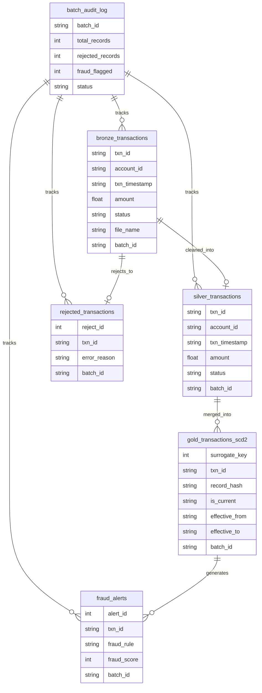

# Bank Transaction Fraud Detection Pipeline (DE Project)

This project is an end-to-end **Data Engineering + Analytics** pipeline that simulates a **Bank Transaction Fraud Detection System**.

It includes:
- Synthetic transaction data generation (with fraud patterns + bad data)
- Batch ingestion into SQLite
- Data quality checks and rejected records logging
- Bronze → Silver → Gold processing layers
- SCD Type 2 implementation in Gold layer
- Rule-based + anomaly-based fraud detection
- Audit logging for each pipeline batch run
- Streamlit dashboard for monitoring fraud + data quality + pipeline health


---

## 📌 Project Architecture

### **1. Data Generation**
A synthetic dataset is generated daily with:
- Normal transactions
- Fraud transactions (different fraud patterns)
- Bad records (missing/invalid values)

Generated Files:
- `data/raw/transactions_dayX.csv`
- `data/corrected/corrected_transactions_dayX.csv`


### **2. Data Pipeline Flow**
The pipeline follows the **Medallion Architecture**:

| Layer | Purpose |
|------|---------|
| Bronze | Raw ingested data |
| Silver | Cleaned + validated transactions |
| Gold | Current + historical SCD2 transactions |
| Fraud Alerts | Fraud detection output |
| Rejects | Invalid records rejected during DQ checks |


---

## 🔍 Data Quality Checks Implemented

Records are rejected and moved into `rejected_transactions` table if they fail any of these checks:

### **Null Checks**
- `txn_id` is NULL
- `account_id` is NULL
- `txn_timestamp` is NULL
- `merchant_id` is NULL

### **Amount Checks**
- Amount is 0
- Amount is negative

### **Domain / Allowed Values Checks**
- Invalid `channel` (must be UPI, CARD, ATM, NETBANKING)
- Invalid `status` (must be SUCCESS or FAILED)
- Currency must be INR

### **Duplicate Checks**
- Duplicate `txn_id` values


---

## 🚨 Fraud Detection Rules Implemented

Fraud detection runs on the **Gold current dataset** (`is_current='Y'`) and creates records in `fraud_alerts`.

### Rule 1: High Amount Fraud
- Trigger: amount > 200000

### Rule 2: Rapid Transaction Burst
- Trigger: ≥ 5 transactions within 10 minutes for same account

### Rule 3: Amount Spike Anomaly
- Trigger: amount > mean + 3*std for that account

### Rule 4: Multiple Locations Fraud
- Trigger: same account has transactions from multiple cities in short duration

### Rule 5: Multiple Failed Attempts Fraud
- Trigger: 3+ FAILED followed by SUCCESS

### Rule 6: Shared Device Fraud
- Trigger: same device_id used across multiple accounts


---

## 🧾 Audit Logging

Each pipeline run writes into `batch_audit_log`:
- batch_id
- start_time
- end_time
- status (SUCCESS/FAILED)
- total_records_ingested
- total_rejected
- total_fraud_alerts


---

## 🏗️ Database Tables Created

### Core Tables
- `bronze_transactions`
- `silver_transactions`
- `gold_transactions_scd2`

### Monitoring Tables
- `rejected_transactions`
- `fraud_alerts`
- `batch_audit_log`


---

## ▶️ How to Run the Project

### Step 1: Install dependencies
```bash
pip install -r requirements.txt
```

### Step 2: Generate sample transaction files
```bash
python scripts/generate_data.py
```

### Step 3: Run the pipeline
```bash
python scripts/run_pipeline.py
```

### Step 4: Run the dashboard
```bash
python -m streamlit run dashboard/app.py
```


---

## 📊 Streamlit Dashboard Features

### Fraud Overview Tab
- Total transactions
- Total fraud alerts
- Fraud rate
- Fraud trend over time
- Sample fraud alerts

### Fraud Rules Tab
- Fraud alerts grouped by rule

### Data Quality Tab
- Rejected record count by error reason

### Audit Logs Tab
- Batch history + pipeline health
- Gold sample (SCD2)


---


## 🚀 Possible Enhancements
- Add Airflow orchestration
- Add Kafka streaming ingestion
- Deploy dashboard to cloud
- Use Spark instead of Pandas for large-scale processing
- Add ML model fraud scoring


---

## 🗂️ Database Schema (Simplified)



---

